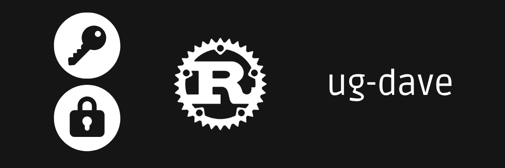
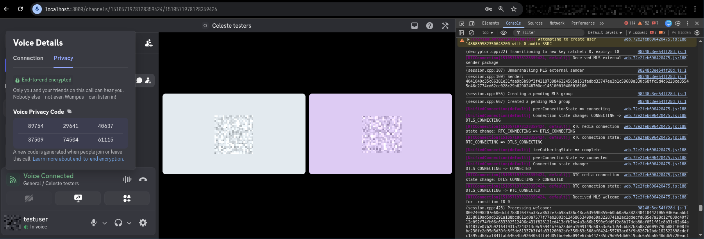

<p align="center">
  
</p>

# ug-dave

a safe rust wrapper around Discord's [libdave](https://github.com/discord/libdave),
the MLS library behind [DAVE](https://daveprotocol.com/) (Discord Audio & Video End-to-End Encryption)

This crate is part of Celeste, a reimplementation of Discord's backend.  
Server-side MLS external-sender surface that the Celeste voice servers uses is included.


celeste's voice gateway is the MLS external sender: it provisions the group
credential, proposes member add/remove, and relays the clients' commits and welcomes, it holds no group keys and never decrypts media, that's what makes it end-to-end

## quick example

```rust
use ug_dave::Dave;

// server side (what the voice gateway does):
let es = Dave::create_external_sender(channel_id, 1)?;
let op25 = es.marshalled_package()?;            // OP 25 External Sender Package
let op27 = es.propose_add(epoch, &key_pkg)?;    // OP 27 Proposals (add a member)
let (commit, welcome) = es.split_commit_welcome(&op28)?;  // OP 29 + OP 30

// client side (the real Discord client; wrapped here for end-to-end tests):
let mut s = Dave::create_session(channel_id, "user_id", 1)?;
s.set_external_sender(&op25)?;
let op26 = s.marshalled_key_package()?;         // OP 26 Key Package
let _commit_welcome = s.process_proposals(&op27, &recognized)?;  // OP 28
let roster = s.process_welcome(&welcome, &recognized)?;          // joined
```

## build modes

- default: a safe stub. `Dave::max_protocol_version()` is `0`, every constructor
  returns `DaveError::Unavailable`, the gateway falls back to non-DAVE
  honestly, never fakes a protocol version
- `--features dave-ffi`: links a prebuilt libdave. build.rs only emits link
  directives; build libdave once with `scripts/build_libdave.sh`

one gotcha worth knowing: libdave's public `dave.h` only exposes the member surface
(sessions, ratchets, encrypt/decrypt). The external-sender surface this server needs
lives in libdave's test tree and links mlspp directly, so the FFI build compiles that
wrapper too

## important, ug-dave is not

- not the voice gateway per-room registry/fan-out/OP 11/13, committer logic
  and timeouts live in `services/voice`, here it's just the FFI seam + protocol types
- not an MLS reimplementation: no crypto in Rust, a thin wrapper over libdave's C
  ABI (+ the external-sender wrapper), correctness comes from running the client's code
- not a media encryptor/decryptor, frame encrypt/decrypt is the client's job inside
  libdave; the server never derives a group key, this crate wraps group signaling
- not RTP/SRTP, Opus, mixing, or the SFU.

## status

verified against a real discord client  
they both reach "End to end encrypted" with an identical MLS epoch authenticator

<p align="center">
  
</p>
